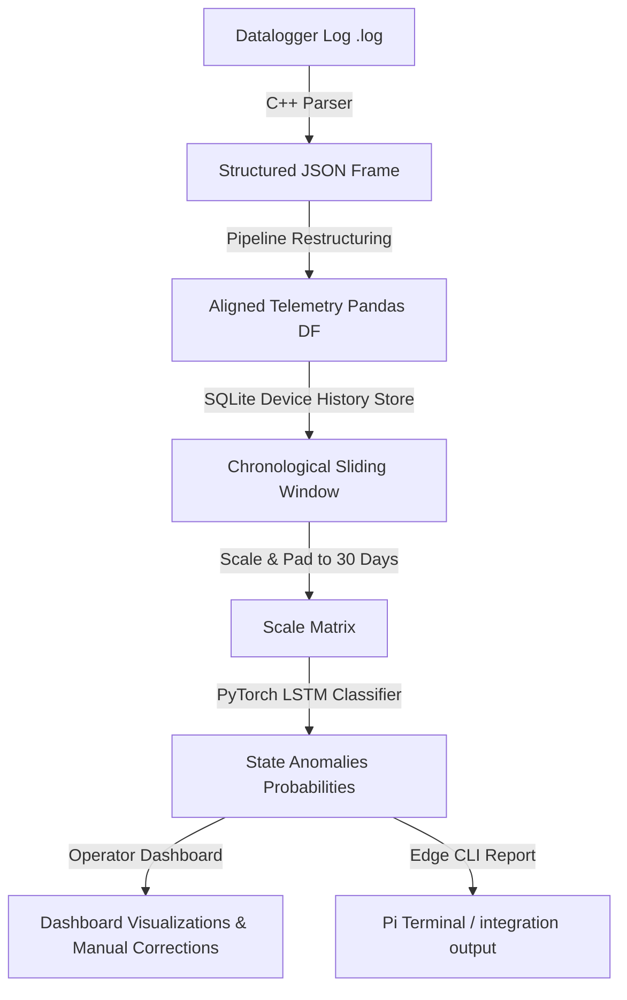

# Solar Panel Anomaly Detection & Telemetry Pipeline

This repository hosts an end-to-end anomaly detection and telemetry processing pipeline designed for remote solar-powered battery logging devices. The project is developed as a **Graduation Project (PFE — Projet de Fin d'Études)** by **Imad Elharchaoui** for **Agamin Solar Agadir**.

The system automates the diagnostic reporting of remote solar battery datalogger logs by parsing unstructured telemetry, running sequential deep learning classification models, and serving interactive dashboards for field technicians and engineers.

---

## 📋 Table of Contents
* [Project Overview](#-project-overview)
* [Directory Layout](#-directory-layout)
* [System Architecture & Pipeline](#%EF%B8%8F-system-architecture--pipeline)
* [Anomaly Classification Models](#-anomaly-classification-models)
* [Web Dashboard Interface & Active Learning](#-web-dashboard-interface--active-learning)
* [Raspberry Pi Edge Client Suite](#-raspberry-pi-edge-client-suite)
* [Simulated Verification & Tests](#-simulated-verification--tests)
* [C++ Parser Compilation](#-c-parser-compilation)
* [Getting Started](#-getting-started)
* [Online Deployment](#-online-deployment)

---

## 🌟 Project Overview

Solar street lights in remote locations record daily metrics (such as battery voltages, state of charge, solar panel outputs, temperatures, and controller flags). Detecting hardware failures early is critical to maintaining operational grid efficiency. 

This project integrates:
1. **C++ Log Parser**: A high-performance parser (`parser-simple`) that processes raw unstructured logs into structured JSON frames.
2. **PyTorch LSTM Neural Network**: A recurrent neural network (`ImprovedLSTMClassifier`) that uses sliding 30-day telemetry history to classify operational state anomalies.
3. **Flask Web Dashboard**: A central web application with user role management (Admin/Technician), local SQLite backup logs, active learning fine-tuning, and interactive telemetry visualization.
4. **Raspberry Pi Edge Daemon**: An edge stack that runs periodic health checks on datalogger telemetry, maintains local historical databases, and automatically synchronizes model parameters with the central web server.

---

## 📂 Directory Layout

The workspace is organized into four main layers (Training, Server Pipeline, C++ Parser, and Edge Client):

```text
SolarSystemAISolution/           <-- Git Repository Root
│
├── setup_envs.bat               <-- Windows Automated Python Environment Creator
├── setup_envs.sh                <-- Linux/macOS Automated Python Environment Creator
├── README.md                    <-- Project Documentation (This File)
├── .gitignore                   <-- Root Git Exclusion Rules
│
├── TrainingModel/               <-- Model Training Workspace
│   ├── .venv/                   <-- Isolated Virtual Environment (Autogenerated)
│   ├── requirements.txt         <-- Training Python Libraries (PyTorch, Pandas, etc.)
│   ├── Gen_data.py              <-- Synthetic Data Generator simulating fault patterns
│   ├── label_real_data.py       <-- Telemetry Labeling Script for raw metrics
│   └── training-model.ipynb     <-- PyTorch LSTM Training & Export Notebook
│
├── PipeLine/                    <-- Web Application & Central Server Workspace
│   ├── .venv/                   <-- Isolated Virtual Environment (Autogenerated)
│   ├── requirements.txt         <-- Web App Python Libraries
│   ├── app.py                   <-- Flask Web Server & Active Learning API
│   ├── pipeline.db              <-- SQLite Server Database (Stores users, runs, corrections)
│   ├── models/                  <-- Pre-trained PyTorch Weights & Scalers
│   │   ├── lstm_fault_detector.pth
│   │   ├── model_config.pkl
│   │   ├── scaler.pkl
│   │   ├── label_encoder.pkl
│   │   └── feature_columns.pkl
│   ├── parser/                  <-- Compiled Parser Executables (Invoked by app.py)
│   │   ├── parser.exe           <-- Windows binary
│   │   └── parser-linux         <-- Linux binary (for production deployment)
│   └── templates/
│       └── index.html           <-- Glassmorphic User Interface
│
├── parser-simple/               <-- C++ Parser Source Code Workspace
│   ├── CMakeLists.txt           <-- CMake Build Configuration
│   ├── include/                 <-- C++ Header Files (space_parser.h, types.h, etc.)
│   └── src/                     <-- C++ Implementation Files (main.cpp, space_parser.cpp, etc.)
│
├── RaspberryPi/                 <-- Raspberry Pi Edge Client Deployment Suite
│   ├── .venv/                   <-- Isolated Virtual Environment (Autogenerated)
│   ├── requirements.txt         <-- Edge Client Python Libraries (PyTorch CPU, sqlite3, etc.)
│   ├── daily_check.py           <-- Local Telemetry Evaluator and CLI Report Tool
│   ├── sync_model.py            <-- Urllib-based Model Synchronizer Client
│   ├── scheduler.py             <-- Cron-like Background Daemon for Orchestration
│   ├── test_daily_check.py      <-- CSV-based Daily Check Player Simulator
│   ├── test_sync_model.py       <-- Network Update Mock Simulator
│   ├── device_history.db        <-- SQLite Edge Database (Tracks device telemetry)
│   ├── model_version.txt        <-- Locally cached version index
│   └── models/                  <-- Edge copy of Model Weights & Preprocessors (Synchronized)
│
└── resource/                    <-- Telemetry Dataset Dumps (Ignored in Git)
    ├── GenData_Samples.csv
    └── TrueDataUnstructured.json
```

---

## ⚙️ System Architecture & Pipeline



### 1. Parsing & Normalization
* Raw unstructured logs (`.log`) are processed by the compiled C++ parser binary.
* Telemetry records are aligned against the training feature columns mapping (`feature_columns.pkl`).
* Variables are scaled to correct SI units (e.g. millivolts to volts, milliamperes to amperes) and State of Charge (SoC) scaling is performed.

### 2. Sequential Classification
* To track temporal trends, the system requires a **30-day sequence history**.
* If a sequence contains fewer than 30 records, it is padded with zeroes.
* The sequence is normalized using a pre-calculated scikit-learn standard scaler (`scaler.pkl`) and evaluated by the PyTorch LSTM classifier.

---

## 🔍 Anomaly Classification Models

The PyTorch recurrent model (`ImprovedLSTMClassifier`) classifies datalogger telemetry into 8 distinct statuses:

| Anomaly Code | Anomaly Label & Description | Corrective Field Action |
|:---|:---|:---|
| **Normal** | **Normal Status**: Balanced charge/discharge cycles. | No maintenance action required. |
| **F-01** | **Controller Bug**: Controller lockup preventing charge recovery. | Perform hardware power cycle or update firmware. |
| **F-02** | **Low SoC (Weather)**: Battery depletion due to cloud/overcast. | System recovers automatically. Monitor weather patterns. |
| **F-03** | **PV Issue**: Low solar current under warm/sunny skies. | Clean panel surface, check wiring, inspect shadowing. |
| **F-04** | **Load Oscillation**: LED driver/control loop blinking anomalies. | Inspect LED driver outputs and load terminals. |
| **F-05** | **Total Power Loss**: Telemetry values flat zero (e.g. fuse failure). | Replace blown battery fuse and inspect main wires. |
| **F-06a** | **Battery Aging**: Declining daily SoC peaks and capacity EOL. | Schedule battery module replacement. |
| **F-06b** | **Thermal Risk**: Battery temp >45°C during active charging phase. | **URGENT**: Disconnect system; inspect thermal cooling. |

---

## 📊 Web Dashboard Interface & Active Learning

The web server in [PipeLine/app.py](file:///d:/Projects/Stage/SolarSystemAISolution/PipeLine/app.py) hosts a central administration dashboard.

* **User Authentication**: Role-based access control protecting telemetry diagnostics.
  * *Default Administrator*: Username `admin` / Password `admin123`
  * *Default Technician*: Username `imad` / Password `tech123`
* **Upload Interface**: Drag-and-drop ingestion of log files. Runs the C++ parser and feeds outputs into the model.
* **Audit Trails**: Backed by `pipeline.db`, logging the filename, computed prediction, confidence level, date, and user for every analysis.
* **Interactive Charting**: Plotting of telemetry arrays (voltages, current, temperature, SoC) and rolling predictions using Chart.js.
* **Active Learning Loop (`/api/correct`)**:
  * If a technician identifies that the model misclassified a sequence, they can override the decision.
  * The server uses the sequence and performs a **single-step gradient optimization** in memory, updating the weights toward the correct label.
  * The updated model weights are saved back to `lstm_fault_detector.pth` and the server bumps the `model_version` counter.

---

## 📟 Raspberry Pi Edge Client Suite

The edge client components in [RaspberryPi/](file:///d:/Projects/Stage/SolarSystemAISolution/RaspberryPi) allow automated local anomaly monitoring on Raspberry Pi devices without requiring manual uploads.

### 1. Daily Check CLI (`daily_check.py`)
Processes daily telemetry for a local device.
* **Features**:
  * Updates a local SQLite database (`device_history.db`) to log chronological history.
  * Extracts the last 30 days of data, pads if shorter, scales, and runs local PyTorch inference.
  * Supports styled terminal console reports or machine-readable JSON flags.
  * Can be imported as a library function in python files.
* **Terminal Command**:
  ```bash
  python daily_check.py <path_to_daily_log.json> <device_serial_number> [--db-path db.db] [--model-dir models_dir] [--clear-history] [--json] [--email-alert] [--smtp-server SERVER] [--smtp-port PORT] [--smtp-user USER] [--smtp-password PASS] [--smtp-sender SENDER] [--email-recipient RECIPIENT]
  ```
* **Email Alert Configuration**:
  * `--email-alert`: Enable SMTP notifications on anomaly detection (also configurable via `EMAIL_ALERT` environment variable).
  * `--smtp-server`: Host of the SMTP server (defaults to `smtp.gmail.com` or `SMTP_SERVER` env).
  * `--smtp-port`: Connection port of the SMTP server (defaults to `587` or `SMTP_PORT` env).
  * `--smtp-user`: SMTP username credential (defaults to `SMTP_USER` env).
  * `--smtp-password`: SMTP password credential (defaults to `SMTP_PASSWORD` env).
  * `--smtp-sender`: Sender email address (defaults to `SMTP_SENDER` env).
  * `--email-recipient`: Recipient email address (defaults to `EMAIL_RECIPIENT` env).
  > [!TIP]
  > When executing under local debugging mode (via `scheduler.py --mode debugging` or CSV telemetry playbacks in `test_daily_check.py`), the system dynamically tracks notification state and limits email dispatch to a **single alert per test run** to prevent inbox flooding.

### 2. Model Synchronizer (`sync_model.py`)
Allows the edge device to retrieve the latest weights from the central server.
* **Features**:
  * Queries the server's version endpoint (`/api/model/version`).
  * If the server version is newer, downloads weights atomically from (`/api/model/download`) to prevent corruption.
* **Terminal Command**:
  ```bash
  python sync_model.py --server-url http://<SERVER_IP>:5000 [--model-dir models_dir] [--json]
  ```

### 3. Orchestration Daemon (`scheduler.py`)
A scheduling loop that combines the model synchronizer and the daily check.
* **Modes**:
  * `debugging`: Performs model sync checks every 2 minutes and telemetry checks every 1 minute.
  * `production`: Performs weekly model syncs and daily telemetry check evaluations.
* **Terminal Command**:
  ```bash
  python scheduler.py --mode debugging --server-url http://<SERVER_IP>:5000 --serial-number ESP32_SN_TEST
  ```

---

## 🧪 Simulated Verification & Tests

To verify edge routines without physical hardware, two CLI simulators are provided in the client environment:

### 1. Telemetry Simulation (`test_daily_check.py`)
Simulates multi-day edge telemetry operation by reading rows chronologically from a CSV file (`solar_telemetry.csv`), converting columns, and feeding them to the daily check loop with a configurable delay.
* **Terminal Command**:
  ```bash
  python test_daily_check.py --csv solar_telemetry.csv --delay 1.5 --serial ESP32_SIM_01 --clear-history
  ```

### 2. Sync Simulation (`test_sync_model.py`)
Simulates periodic network polling. Includes a mock server mode to demonstrate version checks and updates by increments, or can test live endpoints.
* **Terminal Command**:
  ```bash
  python test_sync_model.py --attempts 10 --delay 2 --simulate-updates
  ```

---

## 💻 C++ Parser Compilation

The C++ parser source code inside [parser-simple/](file:///d:/Projects/Stage/SolarSystemAISolution/parser-simple) compiles into a lightweight standalone JSON parser.

### Build on Windows (MinGW64 & CMake)
```bash
cd parser-simple
mkdir build
cd build
cmake -G "MinGW Makefiles" ..
cmake --build .
```
This outputs `mppt_parser.exe` in `build/`. Copy it to [PipeLine/parser/parser.exe](file:///d:/Projects/Stage/SolarSystemAISolution/PipeLine/parser/parser.exe) to integrate it with the server.

### Build on Linux/macOS
```bash
cd parser-simple
mkdir build
cd build
cmake ..
make
```
This outputs `mppt_parser` in `build/`. Copy it to [PipeLine/parser/parser-linux](file:///d:/Projects/Stage/SolarSystemAISolution/PipeLine/parser/parser-linux) to integrate it with the server.

---

## 🚀 Getting Started

### Prerequisites
* Python 3.10+ (specifically Python 3.12 is configured in scripts)
* CMake & C++ compiler (for building the parser)

### Local Environment Setup

Each workspace component is designed with independent python environments to isolate dependencies. Use the provided setup scripts in the root directory:

* **On Windows**: Run:
  ```cmd
  setup_envs.bat
  ```
* **On Linux/macOS**: Run:
  ```bash
  chmod +x setup_envs.sh
  ./setup_envs.sh
  ```

This will automatically create a `.venv` directory in `TrainingModel/`, `PipeLine/`, and `RaspberryPi/` and install all required modules.

### Running the Services

1. **Web Dashboard Server**:
   * Windows: `.\PipeLine\.venv\Scripts\python PipeLine/app.py`
   * Linux: `./PipeLine/.venv/bin/python PipeLine/app.py`
   * Opens at: [http://127.0.0.1:5000](http://127.0.0.1:5000)

2. **Edge Scheduler Daemon**:
   * Windows: `.\RaspberryPi\.venv\Scripts\python RaspberryPi/scheduler.py --mode debugging --server-url http://127.0.0.1:5000`
   * Linux: `./RaspberryPi/.venv/bin/python RaspberryPi/scheduler.py --mode debugging --server-url http://127.0.0.1:5000`

---

## ☁️ Online Deployment

### Option 1: Render (Web Service)
1. Push your repository to **GitHub**.
2. Log into [Render](https://render.com) and click **New > Blueprint**.
3. Link the repository. Render reads [render.yaml](file:///d:/Projects/Stage/SolarSystemAISolution/render.yaml) to configure resources automatically.

### Option 2: Hugging Face Spaces (Docker)
1. Create a new space in [Hugging Face](https://huggingface.co).
2. Set the SDK to **Docker**.
3. Push files including [Dockerfile](file:///d:/Projects/Stage/SolarSystemAISolution/Dockerfile).
