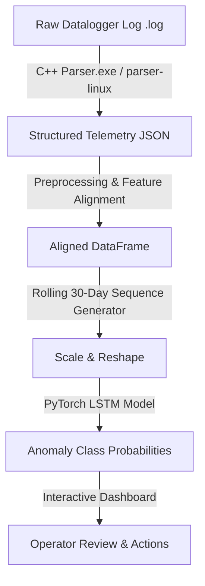

# Solar Panel Anomaly Detection & Telemetry Pipeline

This repository hosts an end-to-end anomaly detection pipeline designed for solar street lights. The project is developed as a **Graduation Project (PFE — Projet de Fin d'Études)** by **Imad Elharchaoui** for **Agamin Solar Agadir**.

The system automates the diagnostic reporting of remote solar battery datalogger logs, parsing unstructured telemetry, running sequential deep learning classification models, and serving interactive dashboards for field technicians and engineers.

---

## 📋 Table of Contents
* [Project Overview](#-project-overview)
* [Directory Layout](#-directory-layout)
* [System Architecture & Pipeline](#%EF%B8%8F-system-architecture--pipeline)
* [Anomaly Classification Models](#-anomaly-classification-models)
* [Web Dashboard Interface](#-web-dashboard-interface)
* [Getting Started](#-getting-started)
* [C++ Parser Compilation](#-c-parser-compilation)
* [Online Deployment](#-online-deployment)

---

## 🌟 Project Overview

Solar street lights in remote locations record daily metrics (such as battery voltages, state of charge, solar panel outputs, temperatures, and controller flags). Detecting hardware failures early is critical to maintaining operational grid efficiency. 

This project integrates:
1. A high-performance **C++ Log Parser** that processes raw unstructured logs into structured JSON frames.
2. A **PyTorch LSTM Neural Network** that uses sliding 30-day telemetry history to predict anomalies.
3. A **Flask Web Application Dashboard** with SQLite backup logs, staff role-based authentication, and interactive Chart.js visualizations.

---

## 📂 Directory Layout

```text
SolarPanelAnomalyDetection/     <-- Git Repository Root
│
├── .gitignore                  <-- Root Git Exclusion Rules
├── render.yaml                 <-- Render Service Deployment Configuration
├── Dockerfile                  <-- Hugging Face Spaces Deployment Configuration
│
├── TrainingModel/              <-- Model Training Workspace
│   ├── .gitignore              <-- Training Workspace Exclusions
│   ├── requirements.txt        <-- Training Python Libraries
│   ├── Gen_data.py             <-- Synthetic Data Generator
│   ├── label_real_data.py      <-- Telemetry Labeling Script
│   └── training-model.ipynb    <-- PyTorch LSTM Training Notebook
│
├── PipeLine/                   <-- Web Application Workspace
│   ├── .gitignore              <-- Web App Workspace Exclusions
│   ├── requirements.txt        <-- Web App Python Libraries
│   ├── app.py                  <-- Flask Web Server & API Backend
│   ├── pipeline.db             <-- Local SQLite Database (Autogenerated)
│   ├── models/                 <-- Pre-trained PyTorch Weights & Scalers
│   │   ├── lstm_fault_detector.pth
│   │   └── ...
│   ├── parser/                 <-- Compiled Executables (Used by app.py)
│   │   ├── parser.exe          <-- Windows binary
│   │   └── parser-linux        <-- Linux binary (for Render/Hugging Face)
│   └── templates/
│       └── index.html          <-- Glassmorphic User Interface
│
├── parser_src/                 <-- C++ Parser Source Code Workspace
│   ├── main.cpp
│   ├── parser.h
│   └── Makefile
│
└── resource/                   <-- Telemetry dataset dumps (ignored in git)
    ├── GenData_Samples.csv
    └── TrueDataUnstructured.json
```

---

## ⚙️ System Architecture & Pipeline



### 1. Log Ingestion
The raw logging telemetry file (`.log`) is uploaded through the dashboard and routed to the C++ parser in [PipeLine/parser](file:///c:/Users/HP/Desktop/Imad-Temp/SolarPanelAnomalyDetection/PipeLine/parser). 
* On **Windows**, it runs `parser.exe`.
* On **Linux** (production server), it runs `parser-linux` (and automatically sets execution permissions).

### 2. Feature Restructuring & Alignment
The backend script converts the JSON parameters into standard units (mV to V, mAh to Ah, and scaling of State of Charge). It matches features dynamically to the [feature_columns.pkl](file:///c:/Users/HP/Desktop/Imad-Temp/SolarPanelAnomalyDetection/PipeLine/models/feature_columns.pkl) mapping used during training to prevent inputs configuration mismatch.

### 3. Deep Learning Classifier
A sequence matrix is generated from the log. For data spans equal to or greater than 30 days, a rolling sequence window outputs predictions day-by-day to visualize the onset and trend of failures.

---

## 🔍 Anomaly Classification Models

The PyTorch recurrent model (`ImprovedLSTMClassifier`) classifies datalogger telemetry into 8 distinct statuses:

| Anomaly Code | Anomaly Label & Description | Corrective Field Action |
|:---|:---|:---|
| **Normal** | **Normal Status**: Balanced charge/discharge cycles. | No maintenance action required. |
| **F-01** | **Controller Bug**: Controller lockup preventing charge recovery. | Perform hardware power cycle or update firmware. |
| **F-02** | **Low SoC (Weather)**: Battery depletion due to cloud/overcast. | System recovers automatically. Monitor weather patterns. |
| **F-03** | **PV Issue**: Low solar current under warm/sunny skies. | Clean panel surface, check wiring, inspect shadowing. |
| **F-04** | **Load Oscillation**: LED driver/control loop blinking anomalies. | Inspect LED driver outputs and load terminals. |
| **F-05** | **Total Power Loss**: Telemetry values flat zero (e.g. fuse failure). | Replace blown battery fuse and inspect main wires. |
| **F-06a** | **Battery Aging**: Declining daily SoC peaks and capacity EOL. | Schedule battery module replacement. |
| **F-06b** | **Thermal Risk**: Battery temp >45°C during active charging phase. | **URGENT**: Disconnect system; inspect thermal cooling. |

---

## 📊 Web Dashboard Interface

The web application is located in the [PipeLine](file:///c:/Users/HP/Desktop/Imad-Temp/SolarPanelAnomalyDetection/PipeLine) directory.

* **Authentication Gateway**: Renders a glassmorphic login screen protecting telemetry insights.
  * *Default Administrator*: Username `admin` / Password `admin123`
  * *Default Technician*: Username `imad` / Password `tech123`
* **Upload Interface**: A drag-and-drop zone with animated upload indicators.
* **Analysis Backup History**: Table auditing past reports, dates, predictions, and which operator ran them.
* **User Management Panel** (Admins Only): Administrative controls to create or delete technician accounts.
* **Interactive Line Charts**: Chart.js graphs displaying anomaly probability history and sensor metrics.

---

## 🚀 Getting Started

### Prerequisites
* Python 3.10+
* PyTorch (CPU or CUDA)
* Flask, Pandas, NumPy, Scikit-learn

### Local Installation

You can set up independent virtual environments for either workspace depending on your needs:

#### A. Setup Model Training Workspace:
```bash
cd TrainingModel
python -m venv .venv
.\.venv\Scripts\activate
pip install -r requirements.txt
```

#### B. Setup Web Application Workspace:
```bash
cd PipeLine
python -m venv .venv
.\.venv\Scripts\activate
pip install -r requirements.txt
```
2. Run the training notebook at [TrainingModel/training-model.ipynb](file:///c:/Users/HP/Desktop/Imad-Temp/SolarPanelAnomalyDetection/TrainingModel/training-model.ipynb) to train the model.

### Running the Web Pipeline Application
Navigate to the root directory and start the Flask web server:
```bash
python PipeLine/app.py
```
Open your browser and navigate to: **[http://127.0.0.1:5000](http://127.0.0.1:5000)**

---

## 💻 C++ Parser Compilation

To compile the C++ parser source code inside [parser_src](file:///c:/Users/HP/Desktop/Imad-Temp/SolarPanelAnomalyDetection/parser_src):

### 1. Compile on Windows (PowerShell/CMD with MSVC or MinGW)
```bash
cd parser_src
g++ -O3 main.cpp -o ../PipeLine/parser/parser.exe
```

### 2. Compile on Linux (for Production Hosting / WSL)
```bash
cd parser_src
g++ -O3 main.cpp -o ../PipeLine/parser/parser-linux
```

---

## ☁️ Online Deployment

### Option 1: Deploy on Render (Web Service)
1. Commit all files (including [render.yaml](file:///c:/Users/HP/Desktop/Imad-Temp/SolarPanelAnomalyDetection/render.yaml)) and push to a **GitHub** repository.
2. Log into [Render](https://render.com) and click **New > Blueprint**.
3. Link your GitHub repository. Render will automatically read `render.yaml` and set up the build and start commands.

### Option 2: Deploy on Hugging Face Spaces (Docker Container)
1. Log into [Hugging Face](https://huggingface.co) and create a **New Space**.
2. Set the **SDK** type to **Docker**.
3. Push your repository files (including the [Dockerfile](file:///c:/Users/HP/Desktop/Imad-Temp/SolarPanelAnomalyDetection/Dockerfile)) directly to the Hugging Face Space repository.

---

## 🎓 Academic Project Context
* **Project Type**: Graduation Project (PFE — Projet de Fin d'Études)
* **Author**: Imad Elharchaoui
* **Company Partner**: Agamin Solar (Agadir, Morocco)
* **Focus Area**: Intelligent Photovoltaic Systems & Predictive Maintenance
