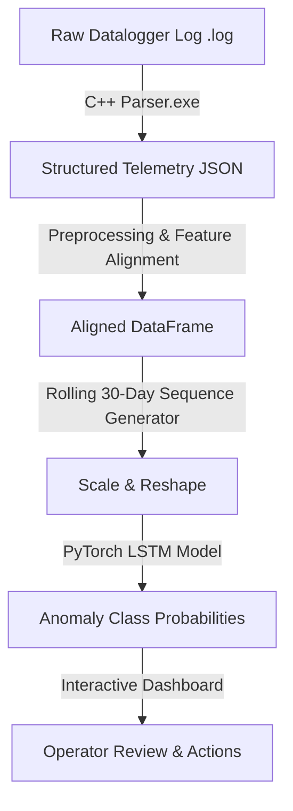

# Solar Panel Anomaly Detection & Telemetry Pipeline

This repository hosts an end-to-end anomaly detection pipeline designed for solar street lights. The project is developed as a **Graduation Project (PFE — Projet de Fin d'Études)** by **Imad Elharchaoui** for **Agamin Solar Agadir**.

The system automates the diagnostic reporting of remote solar battery datalogger logs, parsing unstructured telemetry, running sequential deep learning classification models, and serving interactive dashboards for field technicians and engineers.

---

## 📋 Table of Contents
* [Project Overview](#-project-overview)
* [System Architecture & Pipeline](#%EF%B8%8F-system-architecture--pipeline)
* [Anomaly Classification Models](#-anomaly-classification-models)
* [Web Dashboard Interface](#-web-dashboard-interface)
* [Getting Started](#-getting-started)
* [License](#-license)

---

## 🌟 Project Overview

Solar street lights in remote locations record daily metrics (such as battery voltages, state of charge, solar panel outputs, temperatures, and controller flags). Detecting hardware failures early is critical to maintaining operational grid efficiency. 

This project integrates:
1. A high-performance **C++ Log Parser** that processes raw unstructured logs into structured JSON frames.
2. A **PyTorch LSTM Neural Network** that uses sliding 30-day telemetry history to predict anomalies.
3. A **Flask Web Application Dashboard** that serves as the diagnostic operator portal.

---

## ⚙️ System Architecture & Pipeline



### 1. Log Ingestion
The raw logging telemetry file (`.log`) is uploaded through the dashboard and routed to the C++ parser (`parser.exe`) in the [PipeLine/parser](file:///c:/Users/HP/Desktop/Imad-Temp/SolarPanelAnomalyDetection/PipeLine/parser) folder. The parser extracts individual dataloggers and exports clean JSON structures representing daily records.

### 2. Feature Restructuring & Alignment
The backend script converts the JSON parameters into standard units (mV to V, mAh to Ah, and scaling of State of Charge). It matches features dynamically to the [feature_columns.pkl](file:///c:/Users/HP/Desktop/Imad-Temp/SolarPanelAnomalyDetection/PipeLine/models/feature_columns.pkl) mapping used during training to prevent inputs configuration mismatch.

### 3. Deep Learning Classifier
A sequence matrix is generated from the log. For data spans equal to or greater than 30 days, a rolling sequence window outputs predictions day-by-day to visualize the onset and trend of failures.

---

## 🔍 Anomaly Classification Models

The PyTorch recurrent model (`ImprovedLSTMClassifier`) classifies datalogger telemetry into 8 distinct statuses:

| Anomaly Code | Anomaly Label & Description | Corrective Field Action |
|:---|:---|:---|
| **Normal** | **Normal Status**: Balanced charge/discharge cycles. | No maintenance action required. |
| **F-01** | **Controller Bug**: Controller lockup preventing charge recovery. | Perform hardware power cycle or update firmware. |
| **F-02** | **Low SoC (Weather)**: Battery depletion due to cloud/overcast. | System recovers automatically. Monitor weather patterns. |
| **F-03** | **PV Issue**: Low solar current under warm/sunny skies. | Clean panel surface, check wiring, inspect shadowing. |
| **F-04** | **Load Oscillation**: LED driver/control loop blinking anomalies. | Inspect LED driver outputs and load terminals. |
| **F-05** | **Total Power Loss**: Telemetry values flat zero (e.g. fuse failure). | Replace blown battery fuse and inspect main wires. |
| **F-06a** | **Battery Aging**: Declining daily SoC peaks and capacity EOL. | Schedule battery module replacement. |
| **F-06b** | **Thermal Risk**: Battery temp >45°C during active charging phase. | **URGENT**: Disconnect system; inspect thermal cooling. |

---

## 📊 Web Dashboard Interface

The web application is located in the [PipeLine](file:///c:/Users/HP/Desktop/Imad-Temp/SolarPanelAnomalyDetection/PipeLine) directory.

* **Upload Interface**: A drag-and-drop zone with animated upload indicators.
* **Primary Verdict Card**: Displays predicted fault code, confidence rate, and dynamic descriptions with technician recommendations.
* **Probability Timelines**: Live Chart.js graphs showing how the probability of faults fluctuated day-by-day.
* **Telemetry Sensor Trends**: Interlinked charts plotting voltages, temperatures, charge, and load limits over the log history.
* **Daily Log Viewer**: A paginated, searchable grid of raw values for deep analysis.

---

## 🚀 Getting Started

### Prerequisites
* Python 3.10+
* PyTorch (CPU or CUDA)
* Flask, Pandas, NumPy, Scikit-learn

### Installation
1. Clone the repository and initialize the Python virtual environment:
   ```bash
   python -m venv .venv
   .\.venv\Scripts\activate
   pip install -r requirements.txt
   ```
2. (Optional) Run the training notebook at [src/training-model.ipynb](file:///c:/Users/HP/Desktop/Imad-Temp/SolarPanelAnomalyDetection/src/training-model.ipynb) to re-train the model.

### Running the Web Pipeline Application
Navigate to the root directory and start the Flask web server:
```bash
python PipeLine/app.py
```
Open your browser and navigate to: **[http://127.0.0.1:5000](http://127.0.0.1:5000)**

---

## 🎓 Academic Project Context
* **Project Type**: Graduation Project (PFE — Projet de Fin d'Études)
* **Author**: Imad Elharchaoui
* **Company Partner**: Agamin Solar (Agadir, Morocco)
* **Focus Area**: Intelligent Photovoltaic Systems & Predictive Maintenance
